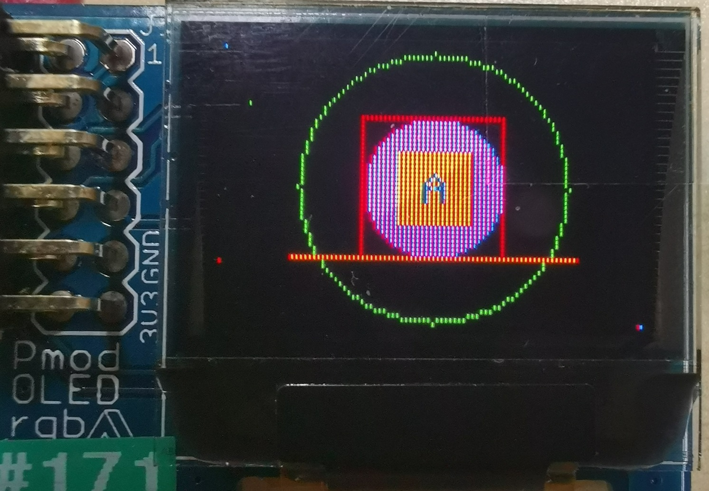
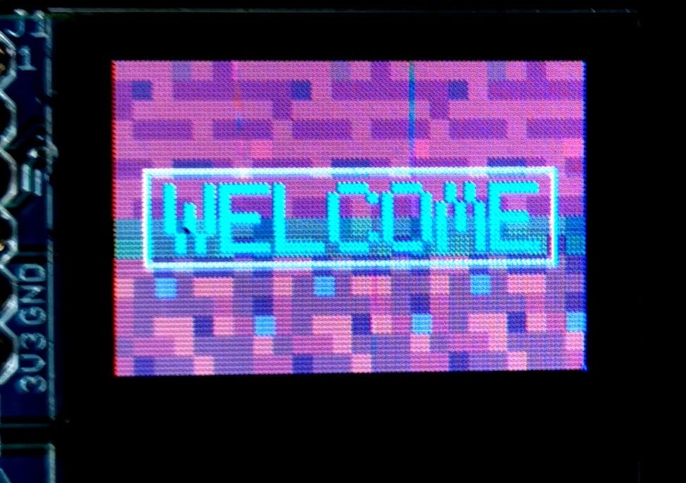
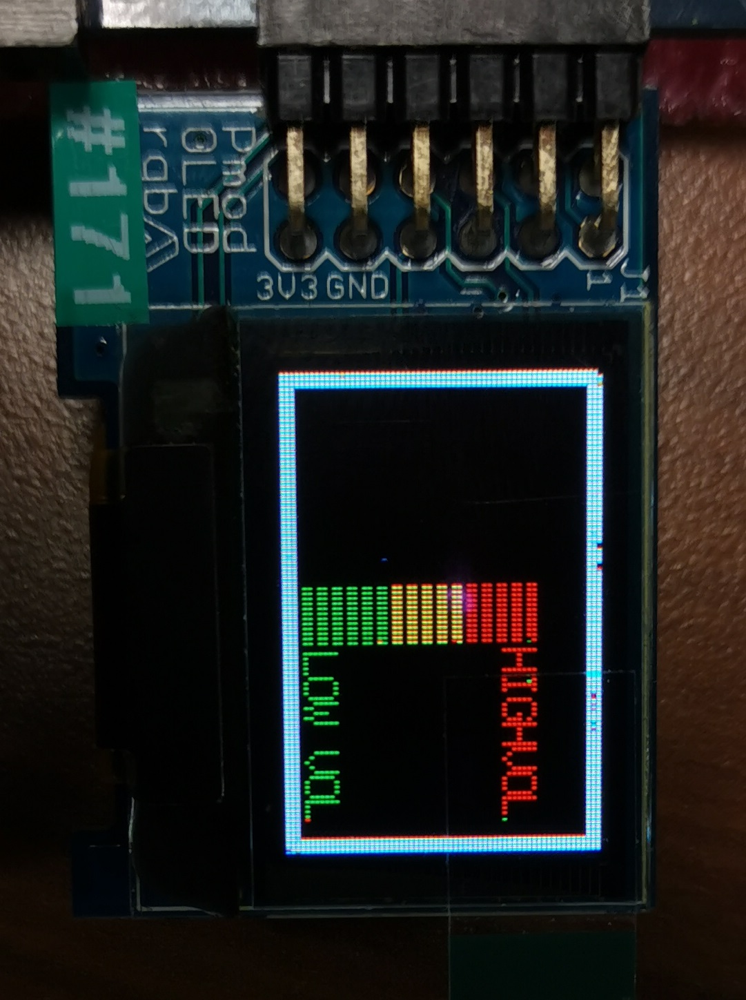
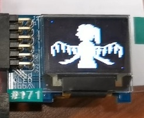
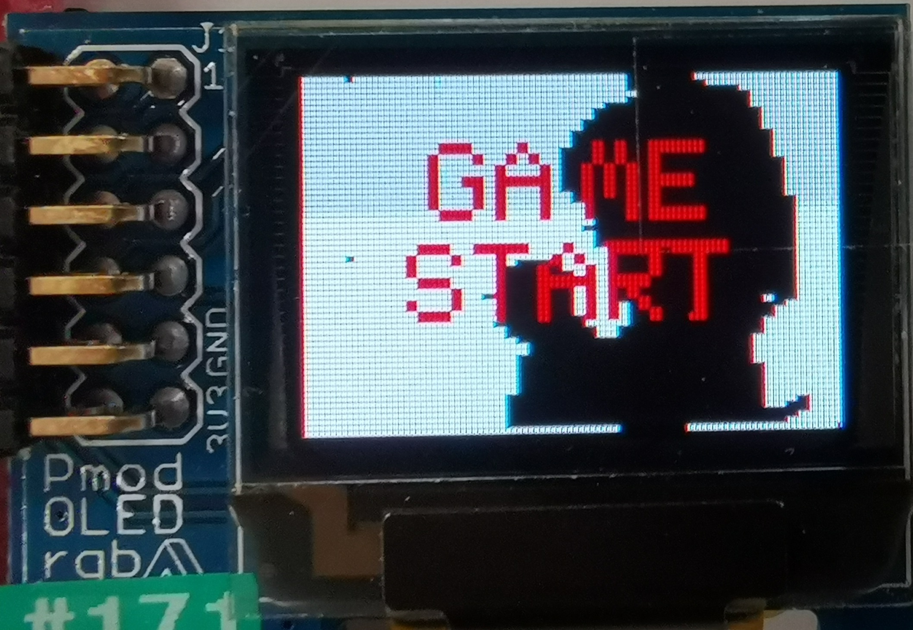
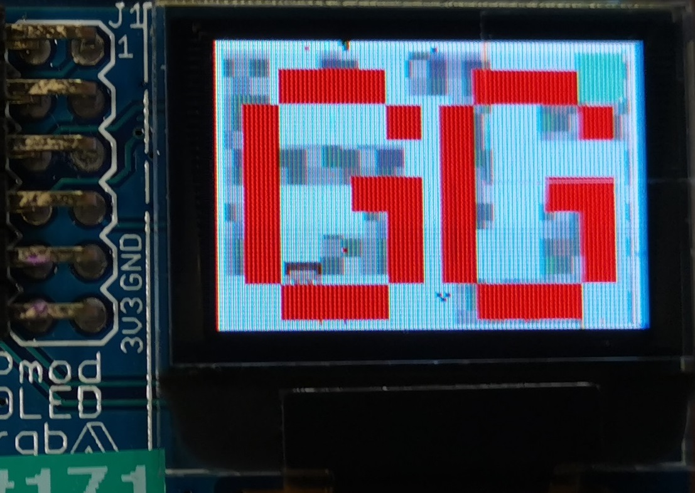

# EE2026_FinalProject2020S1

## About This Project

This project is written in Verilog HDL and runs on Basys3 FPGA board.  
It utilises a Digilent Pmod 96x64 pixel RGB OLED as display, and a Digilent Pmod Mic 3 as audio input.

  <b>Geometry: </b> 
   
  
  <b>Welcome: </b> 
   
  
  <b>Volume Bar: </b> 
   
  
  <b>Touhou: </b> 
   
  
  <b>Good Game: </b> 
   
  
  

## Group Members

|*Name*|*Role*|
| ---- | ---- |
| [*--> To TomLBZ's Webpage*](http://tomlbz.github.io) | Visual Display Integration and add-on structure |
| [*--> To Jingming517's Webpage*](http://jingming517.github.io) | Audio Input Integration |

## Objective of this project

We aim to utilize what we have learnt in EE2026 and develop an entertainment device with the following functionalities:

| ***Index*** | ***Function*** | ***Description*** | ***Operation Manual*** |
| ----------- | -------------- | ----------------- | ---------------------- |
| 1    | Real-time volume indicator | Using LEDs and 7-seg displays to display the audio volume | Dedault mode |
| 2    | OLED graphics | Use switches to change color theme or toggle elements on and off | Switch control |
| 3    | Dedicated Graphics Processing Unit | Support my own graphing command set, can perform graph-drawing with single buffer, supports branching and jumps | use functions provided in the header |
| 4    | Video Decompression | Decompresses 500kb of data into 3.5 min of 10fps video and play it, supports hot pause and play | toggle both sw 13 and 14 to on position to start playing |
| 5    | Fast Fourier Transformation (real-time) | Matches input audio signal onto the closest frequency from 1000Hz, 2000Hz and 3000Hz | toggle both sw 15 and 10 to on position, observe led 13 to 15 |
| 6    | Maze Game | Difficult game of maze. Touch the wall then die. There are visual obstructions as well. | Use buttons to move, centre button to start game after dying |
| 7    | Audio Bar | Shows Audio Volume with text | Toggle sw 14 to off but 13 to on, then use sw 1 to 5 to change display elements, sw 16 to freeze screen |

## Algorithms and Design Features

- Bresenham Line Generation Algorithm
- Bresenham Circle Generation Algorithm
- Dual Port Random Access Memory
- Command Parser and Command Queue
- Graphics Processing Unit (dedicated) with branching and jumps
- Fast Fourier Transformation
- Video decompression (using my own compression algorithm)
